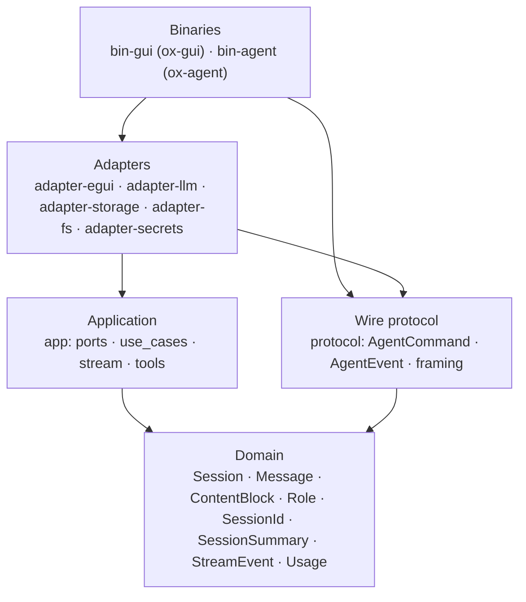

# AGENTS.md

Ox is a desktop AI coding assistant built in Rust. It uses a hexagonal (ports-and-adapters) architecture and a two-process design: an egui GUI (`ox-gui`) spawns one or more headless agent subprocesses (`ox-agent`) and talks to each over NDJSON on stdin/stdout. Pluggable backends cover model providers, session persistence, filesystem access, and secret management.

## Tech Stack

- **Language:** Rust (edition 2024)
- **Build system:** Cargo (virtual workspace — 8 library crates + 2 binary crates)
- **GUI framework:** egui (via eframe)
- **IPC:** NDJSON over stdin/stdout (tokio pipes, `kill_on_drop` for child lifetime)

## Codebase Map

- `crates/domain/` — Core types: `Session`, `Message`, `ContentBlock`, `Role`, `SessionId`, `SessionSummary`, `StreamEvent`, `Usage`. All serde-derived so the same shapes serialize to disk *and* cross the GUI↔agent wire.
- `crates/app/` — Application layer: port traits (`LlmProvider`, `SessionStore`, `SecretStore`, `FileSystem`, `Shell`), use cases (`SessionRunner`, `TurnEvent`), streaming (`StreamAccumulator`, `ToolDef`), tools (`Tool` trait, `ToolRegistry`, `ReadFileTool`, `WriteFileTool`, `EditFileTool`, `GlobTool`, `GrepTool`, hashline helpers). Re-exports `StreamEvent`/`Usage` from domain for caller convenience.
- `crates/protocol/` — Wire protocol between `ox-gui` and `ox-agent`: `AgentCommand`, `AgentEvent`, and `read_frame`/`write_frame` helpers. Depends only on `domain` — no dep on `app` so the wire types cannot accidentally leak application-layer concerns.
- `crates/adapter-llm/` — LLM provider implementations: OpenRouter (streaming via SSE), Ollama (stub).
- `crates/adapter-storage/` — Session persistence: `DiskSessionStore` (one JSON file per session).
- `crates/adapter-egui/` — GUI library: `OxApp` (egui root), `AgentTab` (per-agent state), `AgentClient` (IPC client over stdio with reader/writer tasks), `AgentSpawnConfig`.
- `crates/adapter-fs/` — Filesystem and shell: `LocalFileSystem` (implemented), `BashShell` (stub).
- `crates/adapter-secrets/` — Secret retrieval: `EnvSecretStore` (implemented).
- `crates/bin-gui/` — `ox-gui` binary: composition root for the GUI process. Parses CLI, locates the `ox-agent` binary, spawns the initial agent, passes a cloneable `AgentSpawnConfig` template to `OxApp` for `/new`, runs the egui window. Prints `ox-gui --resume <id>` per active session on shutdown.
- `crates/bin-agent/` — `ox-agent` binary: composition root for the agent process. Parses CLI, wires adapters, builds a `SessionRunner`, and hands control to `driver::agent_driver` which drives NDJSON I/O over stdin/stdout.
- `experiments/` — Throwaway scripts for testing provider APIs.
- `docs/` — Research and design notes.

## Commands

- Build: `cargo build`
- Run: `cargo run -p bin-gui`
- Run the agent headless: `cargo run -p bin-agent -- --workspace-root … --model … --sessions-dir …`
- Test: `cargo test`
- Test (single crate): `cargo test -p <crate-name>`
- Lint: `cargo clippy --workspace --all-targets`
- Format: `cargo fmt`

## Project Rules

- This is greenfield development. There are no users. There are no backwards compatibility concerns.
- Nothing is pre-existing. All builds and tests are green upstream. If something fails, your work caused it. Investigate and fix — never dismiss a failure as pre-existing.
- Use `cargo add` for third-party dependencies -- never hand-edit `[dependencies]` in Cargo.toml. 
- Commits must follow the 7 rules of great commit messages with NO Claude Code attribution.

## Architecture

These diagrams must be kept up to date at all times.

Use separate diagrams for separate questions. Do not collapse structure, crate dependencies, and runtime flow into one graph.

### Structural Layers

The stable architectural shape.



Notes:
- `app` and `protocol` both depend on `domain` and sit at the same layer; neither depends on the other. `protocol` deliberately avoids `app` so wire types can never accidentally drag in application behavior.
- Adapters depend on `app` ports. `adapter-egui` also depends on `protocol` (it speaks the wire format).
- Binary crates compose adapters. `bin-gui` doesn't depend on `bin-agent` — the only coupling between the two processes is the `protocol` crate.

### Current Runtime Path

What is actually implemented today. Two processes, one NDJSON channel between them.

```mermaid
sequenceDiagram
    box rgb(240,240,255) ox-gui process
        participant M as bin-gui main
        participant G as OxApp (egui)
        participant T as AgentTab
        participant C as AgentClient
    end
    box rgb(240,255,240) ox-agent process
        participant D as agent_driver
        participant SR as SessionRunner
        participant SS as SessionStore
        participant LP as LlmProvider
        participant TR as ToolRegistry
        participant ACC as StreamAccumulator
    end

    M->>C: AgentClient::spawn(config) — tokio::process::Command + kill_on_drop
    C->>D: (child process starts)
    D->>SS: load(id) [--resume only]
    D-->>C: AgentEvent::Ready { session_id, workspace_root }
    Note over D,C: NDJSON frames on stdout
    alt resume
        loop each historical message
            D-->>C: AgentEvent::MessageAppended(message)
        end
    end
    C-->>T: deliver events via mpsc channel
    T->>T: record session_id; append historical messages

    M->>G: OxApp::new(vec![tab]); app.run()

    G->>T: user clicks Send
    T->>C: send(AgentCommand::SendMessage { input })
    C->>D: NDJSON on stdin
    D->>SR: start(...) or resume(...) with callback

    SR->>SR: append user message
    D-->>C: AgentEvent::MessageAppended(user)

    loop until no tool calls or iteration cap
        SR->>LP: stream(messages, tool_defs)
        loop each streamed event
            SR->>D: TurnEvent::StreamDelta
            D-->>C: AgentEvent::StreamDelta
            SR->>ACC: push(event)
        end
        ACC-->>SR: completed Message
        SR->>SR: append assistant message
        D-->>C: AgentEvent::MessageAppended(assistant)
        alt assistant emitted tool calls
            loop each tool call
                SR->>TR: execute(name, args)
                TR-->>SR: Result<String>
                SR->>SR: append tool-result message
                D-->>C: AgentEvent::MessageAppended(tool)
            end
        else no tool calls
            Note over SR: exit loop
        end
    end

    SR->>SS: save(updated session)
    D-->>C: AgentEvent::TurnComplete
    C-->>T: turn_complete
    Note over M: GUI exits — AgentClient drops — kill_on_drop SIGKILLs ox-agent
    Note over M: bin-gui prints "ox-gui --resume <id>" per active tab
```

Current status:
- `bin-gui`: composition root for the GUI process. CLI (`--resume <id>`, `--model`), API key from env, locates `ox-agent` next to `current_exe()`, spawns the initial agent, passes a cloneable spawn config to `OxApp` for `/new`, runs the egui window, prints one resume command per active session on shutdown.
- `bin-agent`: composition root for the agent process. CLI (`--workspace-root`, `--model`, `--sessions-dir`, `--resume`), wires adapters, runs `driver::agent_driver` over stdin/stdout. On fatal error, emits an `AgentEvent::Error` frame and exits non-zero.
- `protocol`: `AgentCommand` (`SendMessage`), `AgentEvent` (`Ready`, `StreamDelta`, `MessageAppended`, `TurnComplete`, `Error`), `read_frame`/`write_frame` helpers. All enums `#[non_exhaustive]` for forward compatibility.
- `adapter-egui`: `OxApp` renders all sessions as equal-width vertical splits via `ui.columns(N)`. `/new` spawns a new agent and appends a split; `/quit` closes the focused split (or exits the app on the last one). Focus is mouse-driven — clicking a split's input bar makes it active. Per-split state (messages, streaming accumulator, waiting flag, error, session_id) lives on `AgentTab`; per-split input strings live as a parallel `Vec<String>` on `OxApp` to avoid borrow conflicts. `AgentClient` owns the tokio::process `Child` with `kill_on_drop(true)`, runs reader/writer tasks, exposes a channel API.
- `app::tools`: file tool suite — `read_file` (hashlined output with offset/limit), `write_file` (creates parent dirs), `edit_file` (replace/insert_after operations anchored by hashlines with mismatch detection), `glob` (find files by name pattern, sorted, truncated at 200), `grep` (search file contents by regex, returns path:line matches, truncated at 200, skips binary files).
- `adapter-llm/OpenRouterProvider`: implemented streaming path.
- `adapter-llm/OllamaProvider`: stub.
- `adapter-storage/DiskSessionStore`: implemented (load, save, list).
- `adapter-fs/LocalFileSystem`: implemented.
- `adapter-fs/BashShell`: stub.
- `adapter-secrets/EnvSecretStore`: implemented.

Not yet implemented:
- Model/config selection in-app (passed from GUI to agent at spawn; no UI to change mid-session).
- Session management UI (sessions can be resumed via CLI, but no in-app session browser/switcher).
- Error recovery UI (errors displayed but no retry/dismiss).
- Graceful cancel of an in-progress turn. Today the model is "kill the agent subprocess" — dropping the `AgentClient` / `AgentTab` SIGKILLs the agent. A future `AgentCommand::Cancel` that preserves partial state is not yet wired.
- Keyboard focus switching between splits (Ctrl+Left/Right or similar). Focus is mouse-driven only.
- Tool-approval flow (tools auto-execute; destructive tools have no permission gate). Would require an `AgentEvent::ToolCallPending` + `AgentCommand::ApproveToolCall` protocol extension.
- Bash tool (trait and registry are ready; `BashShell` is still a stub).
