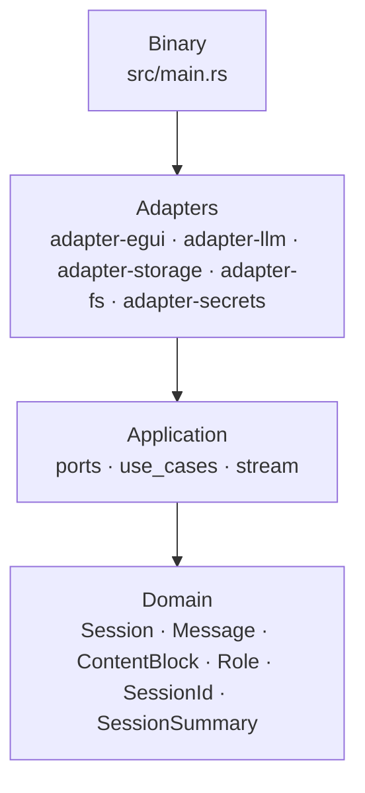
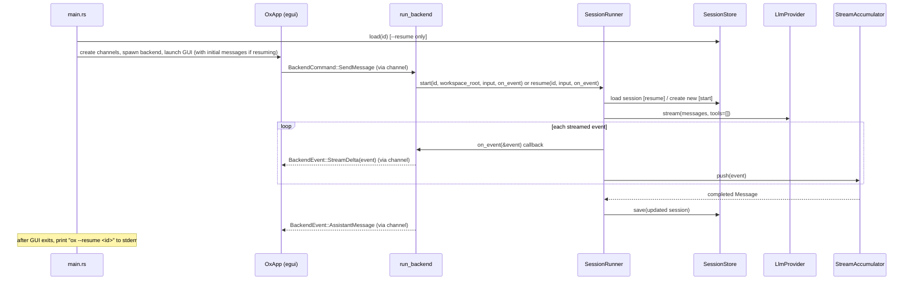

# AGENTS.md

Ox is a desktop AI coding assistant built in Rust. It uses a hexagonal (ports-and-adapters) architecture to stream LLM responses through an egui GUI, with pluggable backends for model providers, session persistence, filesystem access, and secret management.

## Tech Stack

- **Language:** Rust (edition 2024)
- **Build system:** Cargo (workspace with 7 internal crates + root binary)
- **GUI framework:** egui (via eframe)

## Codebase Map

- `src/main.rs` — Binary entry point; composition root wiring adapters, tokio runtime, channels, and GUI
- `crates/domain/` — Core types: Session, Message, ContentBlock, Role, SessionId, SessionSummary
- `crates/app/` — Application layer: port traits (LlmProvider, SessionStore, SecretStore, FileSystem, Shell), use cases (SessionRunner), streaming (StreamEvent, StreamAccumulator, ToolDef)
- `crates/adapter-llm/` — LLM provider implementations: OpenRouter (streaming via SSE), Ollama (stub)
- `crates/adapter-storage/` — Session persistence: DiskSessionStore (stub)
- `crates/adapter-egui/` — GUI client: egui/eframe native window with channel-driven backend controller (`backend.rs`)
- `crates/adapter-fs/` — Filesystem and shell: LocalFileSystem (implemented), BashShell (stub)
- `crates/adapter-secrets/` — Secret retrieval: EnvSecretStore (implemented)
- `experiments/` — Throwaway scripts for testing provider APIs
- `docs/` — Research and design notes

## Commands

- Build: `cargo build`
- Run: `cargo run`
- Test: `cargo test`
- Test (single crate): `cargo test -p <crate-name>`
- Lint: `cargo clippy`
- Format: `cargo fmt`

## Project Rules

- This is greenfield development. There are no users. There are no backwards compatibility concerns.
- Nothing is pre-existing. All builds and tests are green upstream. If something fails, your work caused it. Investigate and fix — never dismiss a failure as pre-existing.
- Use `cargo add` for third-party dependencies -- never hand-edit `[dependencies]` in Cargo.toml. 
- Commits must follow the 7 rules of great commit messages with NO Claude Code attribution.

## Architecture

These diagrams must be kept up to date at all times.

Use separate diagrams for separate questions. Do not collapse structure, crate dependencies, and runtime flow into one graph.

### Structural Layers

The stable architectural shape.

Notes:
- `app` depends on `domain`.
- Adapters depend on `app` ports.
- Some adapters also depend directly on `domain` types for translation and persistence.

### Current Runtime Path

What is actually implemented today.

Current status:
- `src/main.rs`: composition root with CLI parsing (`--resume <id>`), session pre-loading, adapter wiring, and resume-command output on exit.
- `adapter-egui`: channel-driven GUI with message display, text input, send button, event polling, and incremental streaming display. Accepts initial messages for session resume. `backend.rs` contains the `run_backend` controller and channel protocol types (`BackendCommand`, `BackendEvent` including `StreamDelta`). Backend accepts an optional initial session ID and returns the final session ID.
- `adapter-llm/OpenRouterProvider`: implemented streaming path.
- `adapter-llm/OllamaProvider`: stub.
- `adapter-storage/DiskSessionStore`: implemented (load, save, list).
- `adapter-fs/LocalFileSystem`: implemented.
- `adapter-fs/BashShell`: stub.
- `adapter-secrets/EnvSecretStore`: implemented.

Not yet implemented:
- Streaming reasoning/tool-call display (reasoning tokens and tool calls are accumulated but not rendered incrementally).
- Model/config selection (model is hardcoded).
- Session management UI (sessions can be resumed via CLI, but no in-app session browser/switcher).
- Error recovery UI (errors displayed but no retry/dismiss).
- Cancel/stop generation (no way to abort an in-progress stream).
